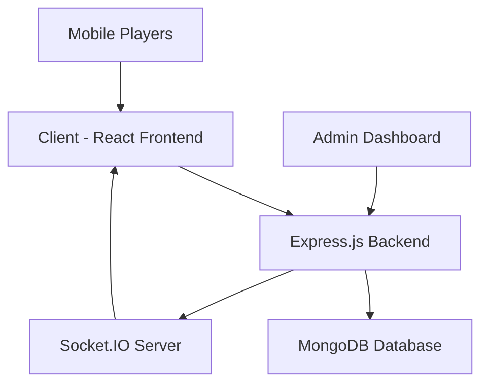

```mermaid
graph TB
    A[Client - React Frontend] --> B[Express.js Backend]
    B --> C[MongoDB Database]
    B --> D[Socket.IO Server]
    D --> A
    E[Admin Dashboard] --> B
    F[Mobile Players] --> A
```
